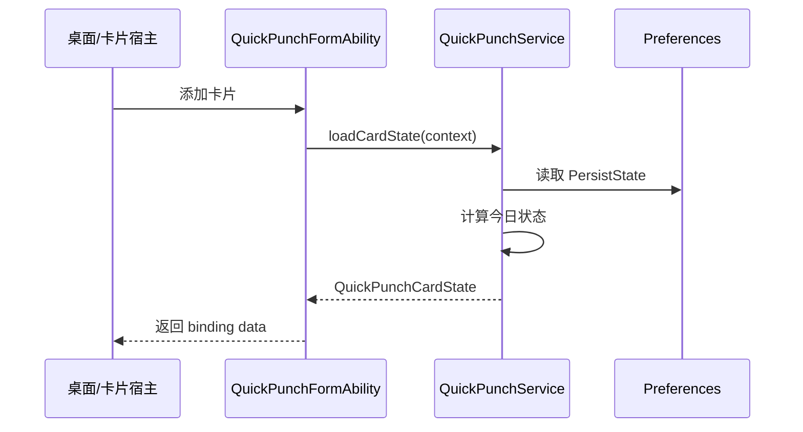
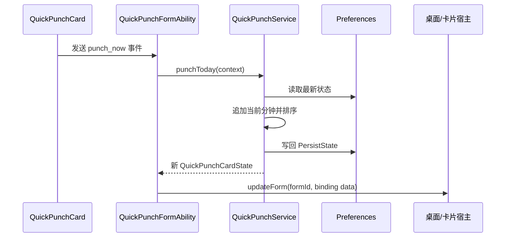

# 桌面卡片与快捷打卡入口开发方案

## 1. 背景

当前应用已经支持首页打卡、编辑上下班时间、周/月历查看、目标平均工时、排除时段、主题切换、CSV/ZIP 导入导出和 Preferences 本地持久化。桌面卡片的目标是把最高频动作“立即打卡”和最高频信息“今天是否已打卡、当前工时、月平均差距”前置到桌面，减少用户进入应用的次数。

本方案面向 HarmonyOS ArkTS 服务卡片能力设计。开发时应以当前 DevEco Studio / HarmonyOS SDK 中的官方 Form Kit 文档和 API 提示为准，尤其是 `FormExtensionAbility` 生命周期、卡片配置文件和卡片交互事件。

参考资料：

- HarmonyOS ArkTS Widget interaction overview: https://developer.huawei.com/consumer/en/doc/harmonyos-guides-V13/arkts-ui-widget-interaction-overview-V13
- HarmonyOS ArkTS 服务卡片配置: https://developer.huawei.com/consumer/cn/doc/harmonyos-guides/arkts-ui-widget-configuration
- HarmonyOS ArkTS Widget lifecycle: https://developer.huawei.com/consumer/en/doc/harmonyos-guides-V13/arkts-ui-widget-lifecycle-V13

## 2. 目标与非目标

### 2.1 目标

- 在桌面卡片上展示今日打卡状态。
- 支持从桌面卡片一键记录当前时间为今日打卡。
- 支持从桌面卡片跳转到应用首页或今日详情。
- 卡片与应用首页共享同一份 Preferences 状态。
- 卡片打卡后，应用首页再次打开时能看到一致数据。
- 支持浅色、深色或跟随系统的基本视觉一致性。

### 2.2 非目标

- 第一版不在卡片上编辑历史日期。
- 第一版不在卡片上管理排除时段、目标工时、导入导出。
- 第一版不支持复杂打卡明细编辑，只做“追加当前时间”。
- 第一版不实现云同步或跨设备同步。

## 3. 用户场景

### 3.1 快速上班打卡

用户早上看到卡片显示“今日未打卡”，点击“打卡”后，卡片立即显示第一条打卡时间，例如 `09:03`。

### 3.2 快速下班打卡

用户晚上看到卡片显示“已打 1 次”，点击“打卡”后，卡片显示上班/下班时间和当日工时。

### 3.3 查看今日状态

用户不进入应用，也能看到：

- 今日日期。
- 今日工时。
- 上班打卡时间。
- 下班打卡时间。
- 月平均工时与目标差距。

### 3.4 进入应用修正

用户发现误打卡或需要补录时，点击卡片中的“详情”区域进入应用首页，再通过现有首页编辑功能修正。

## 4. 卡片规格

### 4.1 推荐尺寸

第一版建议以“纯打卡按钮卡片”为最小入口，尺寸策略如下：

- 默认最小尺寸：`1*1`，仅放一个打卡按钮。
- 可选增强尺寸：`1*2`，展示简短状态加打卡按钮。
- 扩展信息尺寸：`2*2`，展示今日打卡状态和当前工时。
- 报表尺寸：`2*4`，展示更多月度统计信息。

根据 HarmonyOS 官方服务卡片配置文档，卡片尺寸支持 `1*1`。本项目第一版应把 `1*1` 作为默认快捷打卡入口，满足“桌面上只有一个打卡按钮”的诉求。

`form_config.json` 中建议按以下策略配置：

```json5
{
  "defaultDimension": "1*1",
  "supportDimensions": ["1*1", "1*2", "2*2", "2*4"]
}
```

如果第一版只想交付最小按钮入口，也可以先只保留：

```json5
{
  "defaultDimension": "1*1",
  "supportDimensions": ["1*1"]
}
```

注意：`defaultDimension` 必须包含在 `supportDimensions` 中。

### 4.2 1*1 按钮卡片内容

`1*1` 只承载一个动作，不展示复杂信息。

内容建议：

- 中心主按钮：`打卡` 或打卡图标。
- 成功后短暂切换为 `已打` 或通过卡片刷新后的按钮状态体现。

交互建议：

- 点击按钮：执行 `punch_now`。
- 长按/系统卡片菜单：由系统提供，不在业务内处理。
- 不单独设计“打开应用”区域，因为 `1*1` 空间不足；需要打开应用时由用户进入应用图标或使用 `1*2` 卡片。

视觉建议：

- 使用品牌色实心按钮。
- 文案不超过 2 个汉字。
- 不展示今日时间，避免挤压和截断。

### 4.3 1*2 按钮卡片内容

`1*2` 是最小增强方案，仍以快捷打卡为主，同时补充一句状态信息。

内容建议：

- 左侧：今日状态小字，例如 `未打卡`、`已打 1 次`、`8h 30m`。
- 右侧：主按钮 `打卡`。

交互建议：

- 主按钮：执行 `punch_now`。
- 状态区域：打开应用首页。

### 4.4 2*2 小卡片内容

`2*2` 建议展示：

- 应用名或短标题：`工时簿`。
- 今日状态：
  - 未打卡：`今天还未打卡`
  - 1 次打卡：`上班 09:03`
  - 2 次及以上：`09:03 - 18:42`
- 当前工时：例如 `8h 39m`。
- 主按钮：`打卡`。

小卡片点击区域：

- 主按钮：执行快捷打卡。
- 其他区域：打开应用首页。

### 4.5 2*4 中卡片内容

`2*4` 建议展示：

- 今日日期与星期。
- 上班时间、下班时间。
- 当前工时。
- 已扣除排除时段数量。
- 本月平均工时。
- 与目标差距。
- 主按钮：`打卡`。
- 次按钮：`打开`。

## 5. 状态模型

新增一个面向卡片展示的轻量状态对象，避免卡片 UI 直接理解完整业务模型。

```ts
export class QuickPunchCardState {
  todayKey: string = '';
  todayLabel: string = '';
  punchCount: number = 0;
  startTimeText: string = '--:--';
  endTimeText: string = '--:--';
  workMinutesText: string = '0h 0m';
  monthAverageText: string = '0h 0m';
  differenceText: string = '与目标持平';
  canPunch: boolean = true;
  lastUpdatedText: string = '';
  themeMode: string = 'system';
}
```

卡片状态由业务服务统一生成，不建议在卡片组件内重复计算工时。

## 6. 架构设计

### 6.1 新增文件建议

```text
main/src/main/ets/form/QuickPunchFormAbility.ets
main/src/main/ets/components/widget/QuickPunchCard.ets
main/src/main/ets/service/QuickPunchService.ets
main/src/main/ets/model/QuickPunchCardState.ets
main/src/main/resources/base/profile/form_config.json
```

如果 DevEco 模板生成的目录名不同，优先沿用模板命名。例如部分模板会使用 `widget/WidgetCard.ets` 或 `form/EntryFormAbility.ets`。

### 6.2 复用现有模块

应复用：

- `TimeUtils`：日期、时间格式化。
- `PunchCalculator`：当日工时和月平均工时计算。
- `WorkTimeStateService`：状态复制和持久化入口。
- `IndexPreferencesService`：Preferences JSON 状态读写。
- `ThemeService`：主题 token 和色值。

需要注意：卡片 Ability 不应依赖页面的 `UIContext`，因此要把“打卡追加当前时间、生成卡片状态、刷新卡片绑定数据”放到纯 service 中。

## 7. 数据流

### 7.1 添加卡片



### 7.2 卡片快捷打卡



### 7.3 打开应用

卡片非按钮区域或“打开”按钮发送打开应用事件。建议携带参数：

```json
{
  "target": "today",
  "source": "quick_punch_card"
}
```

首页收到参数后，若当前已有 `selectedDateKey`，仍可优先跳转到今天，保证桌面入口语义一致。

## 8. 核心业务规则

### 8.1 打卡追加规则

- 打卡总是追加“当前本地时间”的分钟值。
- 写入前读取最新 Preferences，避免覆盖应用内刚产生的新数据。
- 写入后对当天 `punches` 升序排序。
- 当天不存在记录时创建 `DailyPunchRecord(todayKey, [currentMinute])`。
- 当天已有记录时追加当前分钟。

### 8.2 防重复点击

建议第一版增加轻量防抖：

- 如果当天最后一次打卡与当前时间在同一分钟内，则不重复追加。
- 卡片返回状态中可增加提示文案，例如 `刚刚已打卡`。
- 不建议简单禁用全天多次打卡，因为当前业务规则允许多次打卡。

### 8.3 日期边界

- `todayKey` 使用 `TimeUtils.createDateKey(new Date())`。
- 跨零点后第一次卡片刷新或打卡应自动切到新日期。
- 第一版不支持“昨天忘打卡”的卡片补录，需进入应用处理。

## 9. 配置设计

### 9.1 module.json5

在 `extensionAbilities` 中增加卡片扩展 Ability。字段名称以当前 HarmonyOS SDK 模板为准，设计意图如下：

```json5
{
  "name": "QuickPunchFormAbility",
  "srcEntry": "./ets/form/QuickPunchFormAbility.ets",
  "type": "form",
  "exported": false,
  "metadata": [
    {
      "name": "ohos.extension.form",
      "resource": "$profile:form_config"
    }
  ]
}
```

当前项目已经在 `module.json5` 中配置了 `MainBackupAbility`，新增卡片能力时应保留现有 backup 配置。

### 9.2 form_config.json

配置应包含：

- 卡片名称。
- 展示名称。
- 描述。
- ArkTS 卡片 UI 入口。
- 支持尺寸。
- 默认尺寸。
- 是否支持定时刷新。
- 是否支持卡片交互。

建议第一版开启低频定时刷新，用于跨天和状态校正；真正的打卡后刷新通过事件主动更新完成。

## 10. UI 设计原则

### 10.1 视觉

- 和应用当前的浅色/深色 token 保持一致。
- 小卡片信息密度要克制，优先保证“打卡按钮”和“今日状态”清楚。
- 避免在卡片中出现过长说明文案。
- 打卡按钮使用高对比主色，状态信息使用辅助色。

### 10.2 状态文案

建议文案：

- 未打卡：`今天还未打卡`
- 1 次：`已打上班卡`
- 2 次：`今日已形成工时`
- 多次：`已打 {n} 次`
- 打卡成功：`已记录 {HH:mm}`
- 同分钟重复：`刚刚已打卡`

### 10.3 异常状态

如果 Preferences 读取失败：

- 卡片显示默认状态。
- 主按钮仍可点击，但事件处理时再次尝试初始化。
- 失败时不在卡片上展示技术错误，进入应用后由 Toast 或日志处理。

## 11. 实施步骤

### 11.1 第一阶段：共享业务服务

新增 `QuickPunchService`：

- `loadState(context): PersistState`
- `persistState(context, state): void`
- `punchToday(context): QuickPunchCardState`
- `buildCardState(context): QuickPunchCardState`

同时补充单元测试：

- 无记录时打卡创建今日记录。
- 有 1 次记录时追加第二次。
- 同一分钟重复点击不重复追加。
- 追加后 punches 保持升序。
- 跨月时月平均只计算当前月。

### 11.2 第二阶段：卡片 Ability

新增 `QuickPunchFormAbility`，处理：

- 添加卡片时返回默认绑定数据。
- 卡片事件 `punch_now`。
- 卡片事件 `open_app`。
- 卡片刷新生命周期。
- 卡片删除时清理必要的 formId 缓存。

如需支持多个卡片实例，建议保存当前活跃 `formId` 列表，打卡后刷新触发事件的卡片；后续可扩展为刷新全部实例。

### 11.3 第三阶段：卡片 UI

实现 `QuickPunchCard`：

- 使用 binding data 展示卡片状态。
- 主按钮发送 `punch_now`。
- 卡片主体发送 `open_app`。
- 适配 `1*1`、`1*2`、`2*2`、`2*4` 布局。
- 第一版至少完成 `1*1` 布局，其他尺寸可作为后续增强。

### 11.4 第四阶段：配置与资源

- 新增 `form_config.json`。
- 修改 `module.json5` 注册 form extension。
- 补充资源字符串，例如卡片标题、状态文案、按钮文案。
- 如 DevEco 要求，补充卡片预览图或默认图标资源。

### 11.5 第五阶段：联调

联调路径：

1. 安装应用。
2. 添加桌面卡片。
3. 点击卡片打卡。
4. 打开应用首页确认今日记录同步。
5. 在应用内编辑今日打卡。
6. 回桌面确认卡片刷新后状态一致。
7. 清空记录后确认卡片状态回到未打卡。

## 12. 测试清单

### 12.1 单元测试

- `QuickPunchService.punchToday` 创建记录。
- `QuickPunchService.punchToday` 追加记录。
- 同分钟防重复。
- Preferences 旧格式迁移后卡片可读。
- 无效日期记录不会影响卡片状态。
- 排除时段影响今日工时显示。

### 12.2 手工测试

- 浅色模式下卡片显示正常。
- 深色模式下卡片显示正常。
- 跟随系统切换后卡片颜色可接受。
- 卡片点击打卡后立即刷新。
- 卡片点击打开应用后进入首页。
- 应用内打卡后，卡片下次刷新能显示最新状态。
- 跨零点后卡片切换到新日期。
- 导入覆盖今日记录后，卡片刷新结果正确。
- 清空记录后，卡片显示未打卡。

### 12.3 异常测试

- Preferences 初始化失败。
- JSON 状态损坏。
- 连续快速点击打卡按钮。
- 同时打开应用和点击卡片打卡。
- 桌面存在多个卡片实例。

## 13. 验收标准

- 用户可以在桌面卡片完成一次打卡，应用首页记录同步。
- 打卡后卡片展示最新上班/下班时间和今日工时。
- 同一分钟重复点击不会制造重复打卡记录。
- 应用内清空或导入数据后，卡片刷新能显示正确状态。
- `1*1` 最小按钮卡片可正常添加和打卡。
- 小卡片和中卡片在浅色、深色模式下无文本截断和明显错位。
- 新增卡片能力不影响现有首页、设置页、导入导出和单元测试。

## 14. 风险与注意事项

- 卡片 Ability 与页面不是同一个 UI 上下文，不能直接调用页面方法。
- 卡片打卡必须先读最新 Preferences 再写入，避免覆盖应用内修改。
- 卡片交互事件需要按 SDK 当前版本校验，尤其是事件 action 类型、Ability 名称和参数传递格式。
- 如果启用定时刷新，应控制频率，避免不必要耗电。
- 多卡片实例刷新策略要提前定义，第一版至少保证触发打卡的卡片刷新。
- 如果后续支持提醒能力，应避免和卡片快捷打卡重复实现业务规则，统一复用 `QuickPunchService`。

## 15. 后续扩展

- 增加桌面“今日补录”入口，点击后直接打开今日编辑弹窗。
- 增加“下班提醒”卡片状态，例如超过目标工时后提示可下班。
- 增加月度迷你趋势条。
- 增加快捷方式入口，不依赖桌面卡片尺寸。
- 支持多个主题样式：极简、统计增强、仅按钮。
